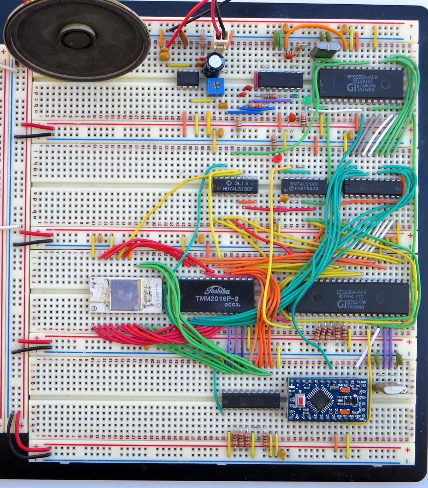

# An Exception-Word EPROM Generator for the CTS256AL2 

## Background

The CTS256 is a companion chip to its better known sibling, the
SP0256 allophone to speech chip. The CTS256 takes ASCII text and
converts it to allophones for the SP0256; text to speech in 2 ICs.

This is 1980s tech that we're talking about, so it has its limitations.
The CTS256 does a *pretty* good job at converting words to allophones,
but every so often it goes off into the weeds. Simple words like "fine",
"purpose" or "minutes" come out as "feen", "purples" or "minuets".

This is where the exception EPROM comes in. If present, it's searched
before the CTS256's text to allophone rules are invoked. If the word is
found in the EPROM, the associated allophones are used directly.

The problem is in the documentation. If you bought a CTS256 from Radio
Shack back in the day, the datasheet that came with it mentioned the
existence of the exception EPROM, and invited you to write to them for
further (read: any) details. The 1988 Archer Semiconductor Reference
Guide was better: it included a copy of a General Instrument application
note that detailed, among other things, the use of the exception EPROM.

But the Archer copy of the application note was full of errors (I think
it was OCR'd - badly - from the original). And the only copy of the
original application note that I could track down on the web was a PDF
of a photocopy of a dot matrix printed original. 8s and Bs, and Gs and
6s were very problematic. And since the exception EPROM contained a
couple of large chunks of TMS7000 machine code, it really mattered
whether that character was an 8 or a B!

I ended up hand disassembling the machine code to try and answer all the
"which character is that?" questions. At the end of that there were
still a couple that could have gone either way (addresses of function
calls in the CTS256s ROM).

Long story short, I burned a 2716 with my best guess at things and,
after moving the address select signal from /CS to /OE to change a 350nS
2716 into a 120nS 2716, it actually worked. Mirabile dictu!

## The Exception-Word Generator is born

Now that I was fairly sure that I had the kinks out of the original
example, it was time to start fixing some of those other words that I'd
noticed the CTS256 getting wrong.

I first tried creating an assembler file full of DB statements. I'm sure
that would have eventually worked, but it was just too painful.

What I really wanted was a program that would read a text file
containing a list of words and their associated allophones, and generate
a hex file that I could burn into an EPROM. Working off and on, I had a
program that produced a working exception EPROM after just a day. It
wasn't pretty, but it worked.

## The Exception-Word list file

The format of the input file to the Xception program is as follows:

       BASE n ; where n is a hex digit between 1 and E, representing the
              ; base 4K address of the generated EPROM
       <[WORD]<=[allophone...]
       <[WORD]<=[allophone...]
            .
            .
            .
       <[WORD]<=[allophone...]
       <[SYMBOL or DIGIT]<=[allophone...]
       <[SYMBOL or DIGIT]<=[allophone...]
            .
            .
            .
       <[SYMBOL or DIGIT]<=[allophone...]

The format of the word/allophone definitions is the same as what's shown
in the GI application note. The words should be ordered alphabetically
(A-Z) but only by the first letter; within each letter group, the
ordering of the words isn't important.

Words that are spoken differently depending on their usage, like *wind*
as a verb (*wind* the clock) or a noun (the *wind* is blowing) can be
differentiated by appending *(V)* or *(N)* to the word definition 
(<[WIND(N)]< for example).

## Exception-Word Encoding Scheme

To store a unique word or symbol and its corresponding allophone address
string in an efficient and flexible manner, the following encoding
format was derived:

       <[encoded word or symbol]< = [encoded allophone address(es)]

       where < equals 13H
             [ equals 40H
             ] equals 80H

The first and last bytes is 13H. This informs the code-to-speech
algorithm that the word or symbol is not a prefix or suffix.

If the word or symbol is an individual letter, then the representation
of it between the brackes is an FFH; this includes the value of the left
and right brackets. If it is a number or punctuation, then it is
represented by its value from TABLE-1 plus the value of the left and
right brackets.

Otherwise.
1. The first letter in the word or symbol is always to be ignored; this
does not apply to numbers or punctuation.
2. The next letter in the word is represented by the value of the letter
from TABLE-1, plus the value of the left bracket "&#91;" which is 40H.
3. The following letter(s), if and only if it is not the last letter in
the word or symbol, is represented solely by its value from TABLE-1.
4. The last letter in the word or symbol is represented by the value of
the letter from TABLE-1, plus the value of the right bracket "]" which
is 80H.

The allophone address string is encoded in a similar manner:

If only one allophone is used for the pronounciation, it is represented
by its value from TABLE-2, plus the value of the left "&#91;" and right "]"
brackets which are 40H and 80H respectively.

Otherwise:

1. The first allophone is represented by its value from TABLE-2, plus
the value of the left bracket "&#91;" which is 40H.
2. The following allophone(s), if and only if it is not the last
allophone in the string, is represented by its value from TABLE-2.
3. The last allophone is represented by its value from TABLE-2 plus the
value of the right bracket "]" which is 80H.

       Example: To encode "Au" to pronounce as "GOLD"
       <[Au]< = [GG2 OW LL DD1]
       13, F5, 13, 7D, 35, 2D, 95 <--This line is ready to store in
           ^                         EXCEPTION-WORD EPROM under the
           |                         "A" category. (The encoded string
           |                         is shown in Hex notation.)
           |
           +--Remember, throw away the first letter (in this case an
              "A"), then find the value of the next letter in TABLE-1
              and add 40H plus 80H to it so as to represent the left
              "[" and right "]" brackets.

For words, the leading "<" (which marks the start of a word) is
mandatory. The trailing "<" (which marks the end of the word)
is optional, and if it's left off it marks
the word as a prefix form. This allows constructs such as:

       <[CAP]A=[KK1 EY PP] ; CAPABILITY, CAPABLE

Without this, "capable" would be pronounced "cap-able", whereas it ought
to be "cape-able".

For symbols, both the leading and trailing "<"s are optional. This
allows symbols to occur in the middle of a word (e.g. "up&down" would
become "up and down" with the example exception list).

TABLE-1

<table border=1 style="text-align: center; margin-left: auto; margin-right: auto">
<tr><th> LETTER</th><th>ENCODED VALUE (hex)</th><th>NUMBER</th><th>ENCODED VALUE (hex)</th><th>SYMBOL</th><th>ENCODED VALUE (hex) </th></tt>
<tr><td>A</td><td>21</td><td>0</td><td>10</td><td>space</td><td>00</td></tr>
<tr><td>B</td><td>22</td><td>1</td><td>11</td><td>!</td><td>01</td></tr>
<tr><td>C</td><td>23</td><td>2</td><td>12</td><td>"</td><td>02</td></tr>
<tr><td>D</td><td>24</td><td>3</td><td>13</td><td>#</td><td>03</td></tr>
<tr><td>E</td><td>25</td><td>4</td><td>14</td><td>$</td><td>04</td></tr>
<tr><td>F</td><td>26</td><td>5</td><td>15</td><td>%</td><td>05</td></tr>
<tr><td>G</td><td>27</td><td>6</td><td>16</td><td>&</td><td>06</td></tr>
<tr><td>H</td><td>28</td><td>7</td><td>17</td><td>'</td><td>07</td></tr>
<tr><td>I</td><td>29</td><td>8</td><td>18</td><td>(</td><td>08</td></tr>
<tr><td>J</td><td>2A</td><td>9</td><td>19</td><td>)</td><td>09</td></tr>
<tr><td>K</td><td>2B</td><td></td><td></td><td>&#42;</td><td>0A</td></tr>
<tr><td>L</td><td>2C</td><td></td><td></td><td>+</td><td>0B</td></tr>
<tr><td>M</td><td>2D</td><td></td><td></td><td>'</td><td>0C</td></tr>
<tr><td>N</td><td>2E</td><td></td><td></td><td>-</td><td>0D</td></tr>
<tr><td>O</td><td>2F</td><td></td><td></td><td>.</td><td>0E</td></tr>
<tr><td>P</td><td>30</td><td></td><td></td><td>/</td><td>0F</td></tr>
<tr><td>Q</td><td>31</td><td></td><td></td><td>:</td><td>1A</td></tr>
<tr><td>R</td><td>32</td><td></td><td></td><td>;</td><td>1B</td></tr>
<tr><td>S</td><td>33</td><td></td><td></td><td><</td><td>1C</td></tr>
<tr><td>T</td><td>34</td><td></td><td></td><td>=</td><td>1D</td></tr>
<tr><td>U</td><td>35</td><td></td><td></td><td>></td><td>1E</td></tr>
<tr><td>V</td><td>36</td><td></td><td></td><td>?</td><td>1F</td></tr>
<tr><td>W</td><td>37</td><td></td><td></td><td>@</td><td>20</td></tr>
<tr><td>X</td><td>38</td><td></td><td></td><td>&#91;</td><td>3B</td></tr>
<tr><td>Y</td><td>39</td><td></td><td></td><td>&#92;</td><td>3C</td></tr>
<tr><td>Z</td><td>3A</td><td></td><td></td><td>]</td><td>3D</td></tr>
<tr><td></td><td></td><td></td><td></td><td>^</td><td>3E</td></tr>
<tr><td></td><td></td><td></td><td></td><td>&#95;</td><td>3F</td></tr>
<tr><td></td><td></td><td></td><td></td><td>&#96;</td><td>40</td></tr>
<tr><td></td><td></td><td></td><td></td><td>{</td><td>5B</td></tr>
<tr><td></td><td></td><td></td><td></td><td>&#124;</td><td>5C</td></tr>
<tr><td></td><td></td><td></td><td></td><td>}</td><td>5D</td></tr>
<tr><td></td><td></td><td></td><td></td><td>~</td><td>5E</td></tr>
</table>
 

TABLE-2

<table border=1 style="text-align: center; margin-left: auto; margin-right: auto">
<tr><th>ENCODED VALUE</th><th>ALLOPHONE</th><th>SAMPLE WORD</th><th>DURATION(ms)</th></tr>
<tr><td>00</td><td>PA1</td><td>PAUSE</td><td>&nbsp;10</td></tr>
<tr><td>01</td><td>PA2</td><td>PAUSE</td><td>&nbsp;30</td></tr>
<tr><td>02</td><td>PA3</td><td>PAUSE</td><td>&nbsp;50</td></tr>
<tr><td>03</td><td>PA4</td><td>PAUSE</td><td>100</td></tr>
<tr><td>04</td><td>PA5</td><td>PAUSE</td><td>200</td></tr>
<tr><td>05</td><td>OY&nbsp;</td><td>bOY</td><td>290</td></tr>
<tr><td>06</td><td>AY&nbsp;</td><td>skY</td><td>170</td></tr>
<tr><td>07</td><td>EH&nbsp;</td><td>End</td><td>&nbsp;50</td></tr>
<tr><td>08</td><td>KK3</td><td>Coab</td><td>&nbsp;80</td></tr>
<tr><td>09</td><td>PP&nbsp;</td><td>Pow</td><td>150</td></tr>
<tr><td>0A</td><td>JH&nbsp;</td><td>dodGe</td><td>400</td></tr>
<tr><td>0B</td><td>NN1</td><td>thiN</td><td>170</td></tr>
<tr><td>0C</td><td>IH&nbsp;</td><td>sIt</td><td>&nbsp;50</td></tr>
<tr><td>0D</td><td>TT2</td><td>To</td><td>100</td></tr>
<tr><td>0E</td><td>RR1</td><td>Rural</td><td>130</td></tr>
<tr><td>0F</td><td>AX&nbsp;</td><td>sUcceed</td><td>&nbsp;50</td></tr>
<tr><td>10</td><td>MM&nbsp;</td><td>Milk</td><td>180</td></tr>
<tr><td>11</td><td>TT1</td><td>parT</td><td>&nbsp;80</td></tr>
<tr><td>12</td><td>DH1</td><td>THey</td><td>140</td></tr>
<tr><td>13</td><td>IY&nbsp;</td><td>sEE</td><td>170</td></tr>
<tr><td>14</td><td>EY&nbsp;</td><td>bEIge</td><td>200</td></tr>
<tr><td>15</td><td>DD1</td><td>coulD</td><td>&nbsp;50</td></tr>
<tr><td>16</td><td>UW1</td><td>tO</td><td>&nbsp;60</td></tr>
<tr><td>17</td><td>AO&nbsp;</td><td>OUght</td><td>&nbsp;70</td></tr>
<tr><td>18</td><td>AA&nbsp;</td><td>hOt</td><td>&nbsp;60</td></tr>
<tr><td>19</td><td>YY2</td><td>Yes</td><td>130</td></tr>
<tr><td>1A</td><td>AE&nbsp;</td><td>hAt</td><td>&nbsp;80</td></tr>
<tr><td>1B</td><td>HH1</td><td>He</td><td>&nbsp;90</td></tr>
<tr><td>1C</td><td>BB1</td><td>Business</td><td>&nbsp;40</td></tr>
<tr><td>1D</td><td>TH&nbsp;</td><td>Thin</td><td>130</td></tr>
<tr><td>1E</td><td>UH&nbsp;</td><td>bOOk</td><td>&nbsp;70</td></tr>
<tr><td>1F</td><td>UW2</td><td>fOOd</td><td>170</td></tr>
<tr><td>20</td><td>AW&nbsp;</td><td>OUt</td><td>250</td></tr>
<tr><td>21</td><td>DD2</td><td>Do</td><td>&nbsp;80</td></tr>
<tr><td>22</td><td>GG3</td><td>wiG</td><td>120</td></tr>
<tr><td>23</td><td>VV&nbsp;</td><td>Vest</td><td>130</td></tr>
<tr><td>24</td><td>GG1</td><td>Guest</td><td>&nbsp;80</td></tr>
<tr><td>25</td><td>SH&nbsp;</td><td>SHip</td><td>120</td></tr>
<tr><td>26</td><td>ZH&nbsp;</td><td>aZUre</td><td>130</td></tr>
<tr><td>27</td><td>RR2</td><td>bRain</td><td>&nbsp;80</td></tr>
<tr><td>28</td><td>FF&nbsp;</td><td>Food</td><td>110</td></tr>
<tr><td>29</td><td>KK2</td><td>sKy</td><td>140</td></tr>
<tr><td>2A</td><td>KK1</td><td>Can't</td><td>120</td></tr>
<tr><td>2B</td><td>ZZ&nbsp;</td><td>Zoo</td><td>150</td></tr>
<tr><td>2C</td><td>NG&nbsp;</td><td>aNchor</td><td>200</td></tr>
<tr><td>2D</td><td>LL&nbsp;</td><td>Lake</td><td>&nbsp;80</td></tr>
<tr><td>2E</td><td>WW&nbsp;</td><td>Wool</td><td>140</td></tr>
<tr><td>2F</td><td>XR&nbsp;</td><td>repaIR</td><td>250</td></tr>
<tr><td>30</td><td>WH&nbsp;</td><td>WHig</td><td>150</td></tr>
<tr><td>31</td><td>YY1</td><td>Yes</td><td>&nbsp;90</td></tr>
<tr><td>32</td><td>CH&nbsp;</td><td>CHurch</td><td>150</td></tr>
<tr><td>33</td><td>ER1</td><td>fIR</td><td>110</td></tr>
<tr><td>34</td><td>ER2</td><td>fIR</td><td>210</td></tr>
<tr><td>35</td><td>OW&nbsp;</td><td>bEAU</td><td>170</td></tr>
<tr><td>36</td><td>DH2</td><td>THey</td><td>180</td></tr>
<tr><td>37</td><td>SS&nbsp;</td><td>veSt</td><td>&nbsp;60</td></tr>
<tr><td>38</td><td>NN2</td><td>No</td><td>140</td></tr>
<tr><td>39</td><td>HH2</td><td>Hoe</td><td>130</td></tr>
<tr><td>3A</td><td>OR&nbsp;</td><td>stORe</td><td>240</td></tr>
<tr><td>3B</td><td>AR&nbsp;</td><td>alARm</td><td>200</td></tr>
<tr><td>3C</td><td>YR&nbsp;</td><td>cleAR</td><td>250</td></tr>
<tr><td>3D</td><td>GG2</td><td>Got</td><td>&nbsp;80</td></tr>
<tr><td>3E</td><td>EL&nbsp;</td><td>saddLE</td><td>140</td></tr>
<tr><td>3F</td><td>BB2</td><td>Business</td><td>&nbsp;60</td></tr>
</table>

## Using the Exception-Word Generator

The Exception-Word Generator is written in fairly standard C. Any
reasonably modern C compiler ought to be able to compile the source.

       xception <input text file >output hex file

The output hex file is sized for a 4K EPROM, as that's what was
specified in the original application note. However, careful reading of
the note reveals that the exception code can spread over multiple 4K
blocks, up to a maximum of 48K using the memory map in the application
note.

A demonstration Arduino sketch is included that shows the operation of
the EPROM. The computer Joshua's lines from the 1983 film
[WarGames](https://en.wikipedia.org/wiki/WarGames). Several words from
Joshua's lines (e.g. file, minutes, island) are not rendered properly by
the CTS256. When the exception-word EPROM is included in the circuit,
they are spoken correctly (without mangling the spelling of the text).

## References

* [GI CTS256A-AL2 Code to Speech Chipset AN-0505D](http://www.textfiles.com/bitsavers/pdf/gi/speech/General_Instrument_-_AN-0505D_-_CTS256A-AL2_Code-to-Speech_Chipset_-_10Dec1986.pdf)
* [Archer 1988 Semiconductor Reference Guide: CTS256AL2 Code-to-Speech chip](https://archive.org/details/ArcherSemiconductorReferenceGuide1988/page/n78/mode/1up)
* [Archer CTS256A-AL2 Technical Data](http://www.8051bits.com/misc-projects/speech%20-%20music%20synthesizers/cts256a-al2.pdf)
